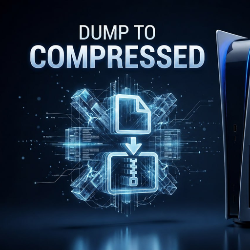
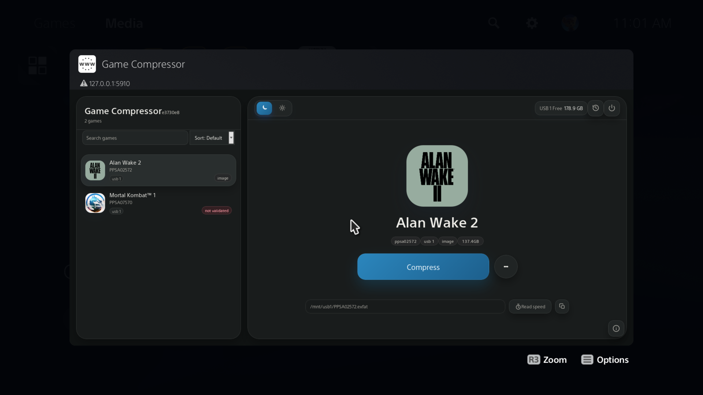

  

<h1 align="center">PS5 Game Compressor</h1>

  

A web-based dashboard to compress, unpack, validate, repair, and move your <a href="https://github.com/drakmor/ShadowMountPlus">ShadowMountPlus</a>-mounted PS5 games.

## Features
- **Compress**: Turn mounted game folders or images into `.ffpfsc` (compressed PFS) output, in `PFS` or `exFAT` format.
- **APR Emu Aware**: Automatically builds the APR Emu `ampr_emu.index` before compressing APR titles, or refresh it manually.
- **Validate & Repair**: Checks compressed games and repairs detected PFSC block issues.
- **Uncompress**: Turns compressed games back into folder/app form.
- **Move**: Relocates titles between internal storage and USB storage.
- **Live Progress**: Progress, speed, ETA, and full operation history — jobs keep running on the PS5 even if you close the browser tab.
- **Home Screen Shortcut**: Installs a "Game Compressor" app icon to your PS5 home screen for quick access.
- **Light & Dark Themes**: Remembered across sessions.

## Requirements
- A PS5 homebrew environment capable of running payload ELFs.
- [ShadowMountPlus](https://github.com/drakmor/ShadowMountPlus) (latest version), installed and managing mounted titles.
- [KStuff Lite](https://github.com/EchoStretch/kstuff-lite/releases) 1.07 Beta or later.
- [Payload Manager](https://github.com/itsPLK/ps5-payload-manager) or another way to launch `game-compressor.elf`.

This is homebrew software. Keep backups of important data and test with non-critical titles first.

## Usage
1. download from the [Releases](../../releases) .
2. Launch `game-compressor.elf`.
3. Open `http://<PS5_IP>:5910/`.
4. Pick a game, then `Compress` (folder/image titles) or `Validate and Repair` (compressed ones).
5. Use the secondary action menu for `Build AMPR Index`, `Uncompress`, `Move to USB`, or `Move to Internal SSD`.
6. Check the History button to review past operations.

When you're done, use the terminate button in the top bar — it removes the home-screen tile and stops the payload.

### Compression settings
`Compress` always produces a `.ffpfsc` file — a compressed PFS container. You're asked for three things:

- **Format** — `exFAT` (default, recommended, especially for APR Emu titles) or `PFS Experimental`.
- **Destination** — compress in place, to Internal SSD, or to External Storage.
- **Original handling** — `Keep original` (safest), `Delete after verified` (writes and validates first, then removes the source — default for in-place compression), or `Destructive` (deletes source data while writing; can't be cancelled once started, same-storage folder compression only).

### APR Emu support
APR Emu titles need an `ampr_emu.index` file and the correct ShadowMountPlus read-only/sector-size settings to run from internal SSD. Game Compressor handles this automatically for the common cases — compressing an APR folder-format game from USB, uncompressing a stuttering compressed title back to exFAT, or making a fresh uncompressed image — building/refreshing `ampr_emu.index` and applying read-only settings as needed. The one manual case: an existing exFAT image with no index yet — run the game once from USB without read-only settings so APR Emu can create it, then copy to internal SSD and use `Set Read Only`.

The in-app `APR-EMU Version` picker reads Pippo's public [APR-EMU manifest](https://pippo26442999.github.io/.exFAT/ampr-emu-drakmor/manifest.json) at build/run time — no version is pinned in this repo. Custom `.sprx`/`.prx` files can also be uploaded manually from a desktop browser. Upstream source: [drakmor/ampr_emu](https://github.com/drakmor/ampr_emu).

### Game discovery
Mounted games are shown automatically. Game Compressor also scans `/data/homebrew`, `/data/etaHEN/games`, and the `/homebrew` and `/etaHEN/games` subpaths of `/mnt/ext0`, `/mnt/ext1`, and `/mnt/usb0`–`/mnt/usb7`.

## Credits
Created by Juma Sayeh. Tested by Osama Abualia.

Built on and inspired by [PSBrew/MkPFS](https://github.com/PSBrew/MkPFS) and Drakmor's [ShadowMountPlus](https://github.com/drakmor/ShadowMountPlus) and [APR Emu](https://github.com/drakmor/ampr_emu) work. Thanks to Pippo (`pippo26442999`) for maintaining the public APR-EMU manifest used by the in-app version picker.

Made with love in Palestine.

## License
Licensed under the [GNU General Public License v3.0](LICENSE) or (at your option) any later version. This project links against [`ps5-payload-sdk`](https://github.com/ps5-payload-dev/sdk) (GPLv3) and is built on top of ShadowMountPlus (GPLv3) — GPLv3 keeps this compatible with both.

## Disclaimer
Experimental PS5 homebrew software. Use at your own risk. Not affiliated with Sony, PlayStation, or any game publisher.
